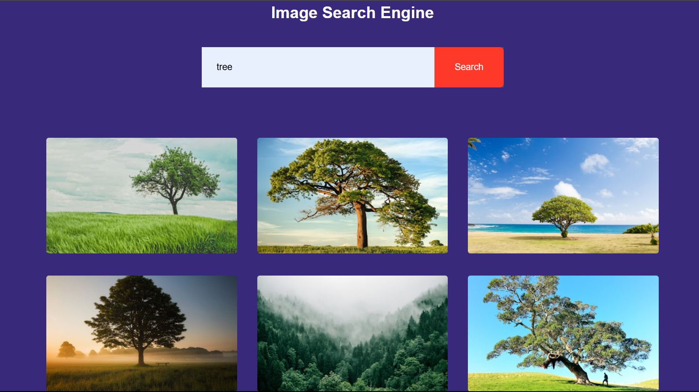

# 🖼️ Image Search Engine

A sleek and simple web-based Image Search Engine that allows users to search for high-quality images on any topic using the [Unsplash API](https://unsplash.com/developers). Built with pure HTML, CSS, and JavaScript — no frameworks!

## 🔍 Features

- 🔎 Search for images based on any keyword
- 🖼️ Displays beautiful image results from the Unsplash API
- ⬇️ Click on any image to download in full resolution
- 📚 Categories like nature, animals, cars, technology, and more
- ⚡ Fast and responsive UI

## 🚀 Live Demo

[](https://searchimageanddownload.netlify.app)

🔗 **Live Site**: [https://searchimageanddownload.netlify.app](https://searchimageanddownload.netlify.app)

## 🛠️ Tech Stack

- HTML
- CSS
- JavaScript
- Unsplash API

## 📁 Folder Structure

```bash
📁 image-search-engine/
├── index.html          # Main HTML file
├── style.css           # Styling (CSS)
├── script.js           # JavaScript for search functionality
├── screenshot.png      # Preview screenshot
├── README.md           # Project documentation
```

## 📦 How to Run Locally

```bash
git clone https://github.com/DonePrakash/image-search-engine
cd image-search-engine
# Just open index.html in your browser
